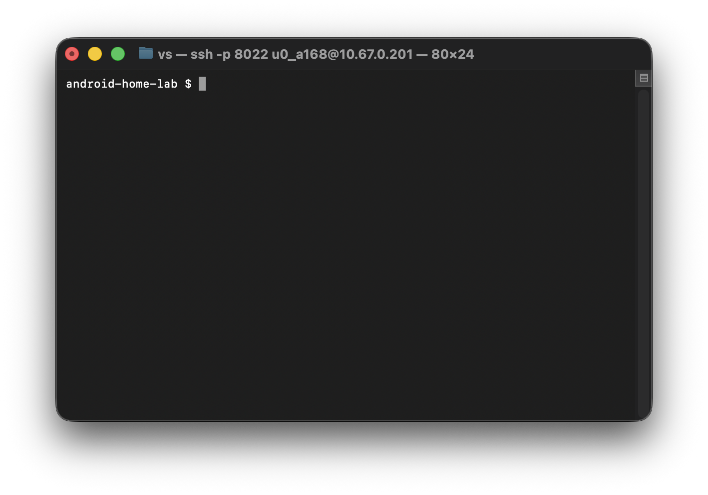

# Android Home Lab Server

## 📌 Overview
This project documents the process of turning an old Android tablet into a private, headless home-lab server controlled remotely from macOS.
The goal is to learn Linux fundamentals, networking, and service hosting using minimal hardware.

The tablet runs lightweight services via Termux, while the Mac acts as the control terminal using SSH.

---

## 🎯 Project Goals
- Learn Linux command-line basics through hands-on experimentation
- Understand networking concepts such as IP addresses and ports
- Practice remote system administration using SSH
- Host and test a real web service
- Build a clean, well-documented GitHub project for learning and showcase

---

## 🧠 Why This Project?
Old Android tablets are often unused but still capable of running lightweight services.
This project explores how such hardware can be repurposed into an educational home-lab environment, similar in concept to cloud servers but on local hardware.

---

## 🏗️ Architecture

### High-Level Design
- Client: macOS laptop (SSH + browser)
- Server: Android tablet running Termux
- Network: Local network or USB tethering

---

## 🔧 Services Implemented

### SSH Access
- Secure remote access from macOS
- Tablet operates in headless mode
- Primary management interface

### Lightweight Web Server
- Python built-in HTTP server
- Serves a custom HTML page
- Accessible via tablet IP and port
- Demonstrates real client–server communication

---

## 📸 Screenshots

### SSH Access from macOS

### Web Server Test

---

## 📚 Documentation
- docs/architecture.md
- docs/environment-decision.md
- docs/networking.md
- docs/lessons-learned.md
- services/web-server.md

---

## 🧠 Skills Demonstrated
- Linux command-line usage
- SSH-based remote system administration
- Networking fundamentals (IP addresses, ports, LAN vs hotspot)
- Hosting and testing a web service
- Debugging real-world device and network constraints
- Documentation-first development approach

---

## ☁️ Relation to Cloud Hosting
This project mirrors core cloud-hosting concepts:

- A machine runs a server process
- The server listens on an IP address and port
- Clients send requests and receive responses

The primary difference is that this setup uses a private local IP instead of a public internet-facing IP, but the architecture and concepts are the same as cloud virtual machines.

---

## 🚧 Limitations
- Local network access only
- Services stop if the device powers off
- No public internet exposure
- No production-grade security hardening

---

## 📌 Project Status
- Core functionality complete
- Persistence and SSH hardening planned

---

## ⚠️ Disclaimer
This project is for educational purposes only and is not intended for production use.

---

## 👤 Author
GitHub: VS-2004
